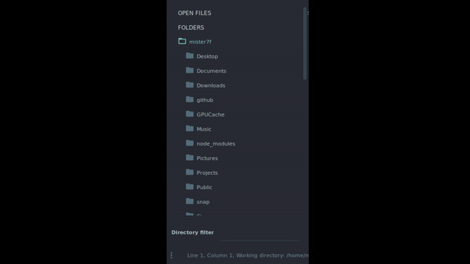

# Directory Filter



Directory filter is a sublime text extension that allows you to filtrate and to search for directories in the sidebar.

Type a regex and all directories whose path match will be displayed in the sidebar.

# Installation
Go to the directory `Packages`, in the configuration directory of sublime, and git clone this repo.

# Keybinding

Key binding example,
```json
{ "keys": ["ctrl+space"], "command": "directory_filter"},
```

# Dependency
Please install `fd-find` to use this package

> https://github.com/sharkdp/fd
